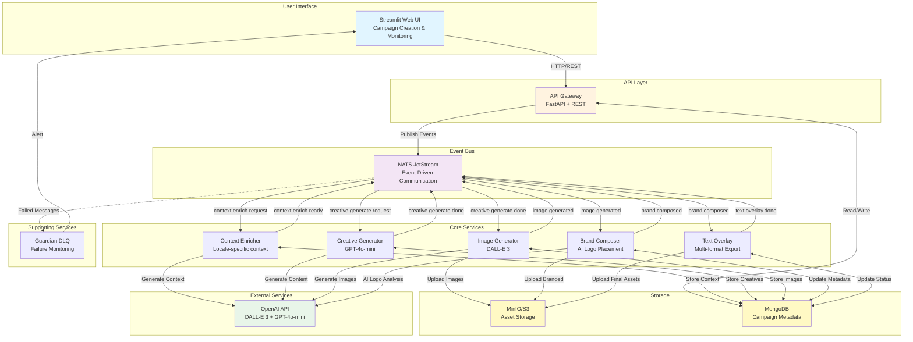
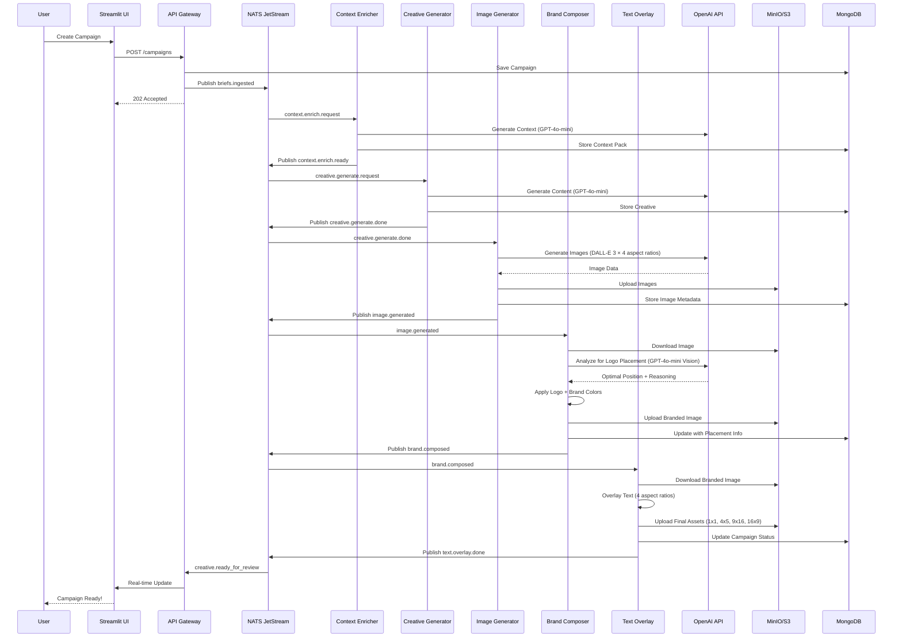
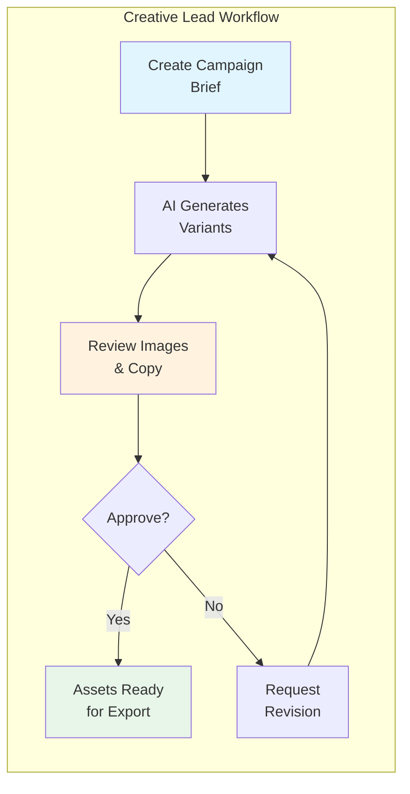
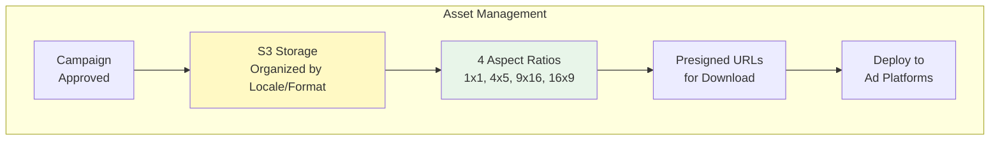
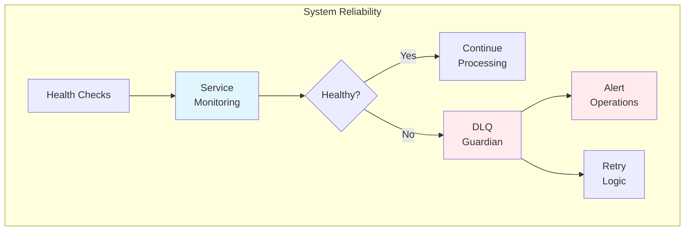
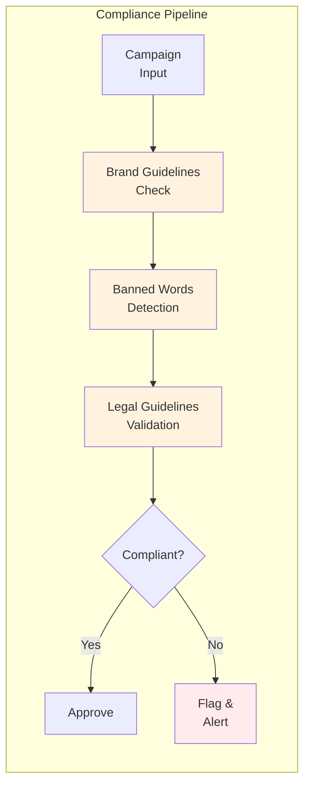
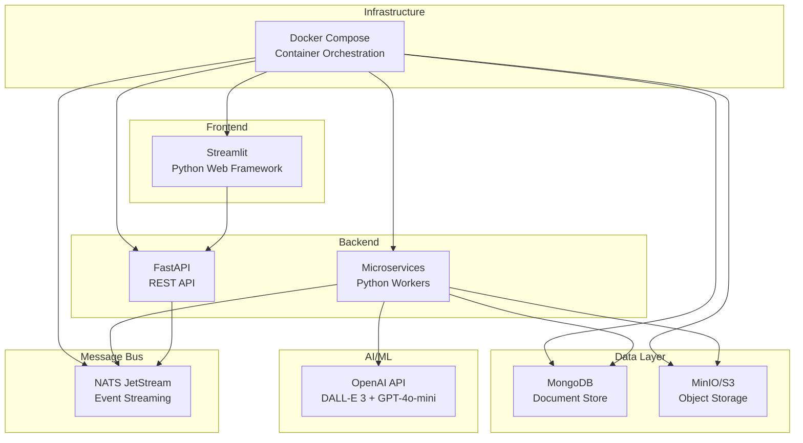
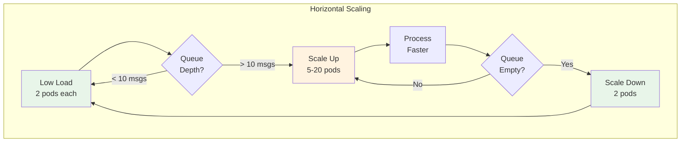
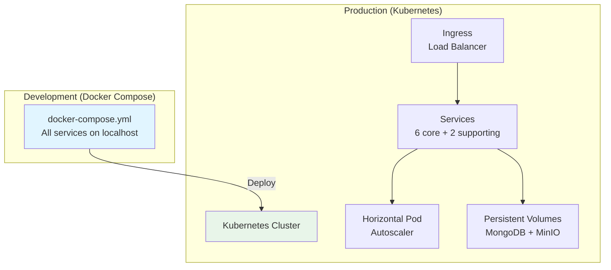

# Architecture Diagram

## High-Level System Architecture

## Data Flow: Campaign Creation to Final Assets

## Stakeholder Views

### Creative Lead View

**Key Features:**
- Real-time campaign status dashboard
- Visual preview of all variants
- One-click approval/revision
- AI-powered logo placement (no manual config)

### Ad Operations View

**Key Features:**
- Automatic multi-format generation
- S3 storage organized by locale/aspect ratio
- Bulk download capabilities
- Presigned URLs for easy sharing

### IT/Engineering View

**Key Features:**
- Event-driven architecture (NATS)
- Dead Letter Queue for failed messages
- Structured logging with correlation IDs
- Health checks and metrics endpoints
- Docker Compose for easy deployment

### Legal/Compliance View

**Key Features:**
- Configurable banned words per locale
- Legal guidelines field
- Compliance validation stage
- All decisions logged with timestamps
- Audit trail available

## Technology Stack

## Scaling Strategy

**Scaling Properties:**
- **Image Generator**: GPU-intensive, scales 2→20 pods based on queue depth
- **Context Enricher**: CPU-bound, scales 2→10 pods
- **Brand Composer**: Memory-intensive (image processing), scales 2→10 pods
- **Text Generator**: LLM API calls, scales 2→15 pods
- **Overlay Composer**: CPU-bound, scales 2→10 pods

## Event Flow

```mermaid
graph LR
    A[briefs.ingested] --> B[context.enrich.request]
    B --> C[context.enrich.ready]
    C --> D[creative.generate.request]
    D --> E[creative.generate.done]
    E --> F[creative.brand.compose.request]
    F --> G[creative.brand.compose.done]
    G --> H[creative.copy.generate.request]
    H --> I[creative.copy.generate.done]
    I --> J[creative.overlay.request]
    J --> K[creative.overlay.done]
    K --> L[creative.ready_for_review]
    
    style A fill:#e1f5ff
    style L fill:#e8f5e9
```

## Deployment Architecture

---

## Diagram Usage

### For Presentations
1. Copy the Mermaid code blocks
2. Paste into [Mermaid Live Editor](https://mermaid.live)
3. Export as PNG/SVG for slides

### For Documentation
- GitHub, GitLab, and many markdown viewers support Mermaid natively
- Diagrams will render automatically

### For Lucidchart/Draw.io
Use these diagrams as reference to create more polished versions with:
- Custom icons
- Brand colors
- Additional annotations
