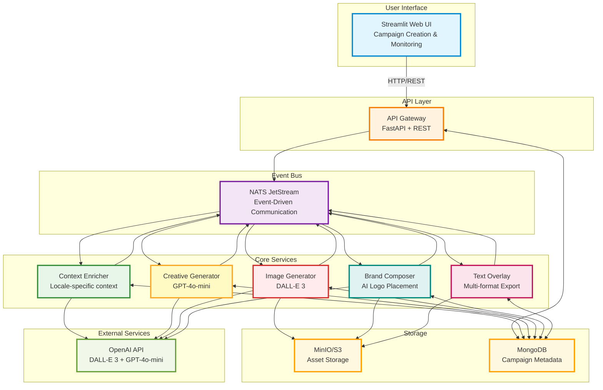

# Simplified Architecture Diagram

## High-Level System Architecture (Simplified)

## Notes

**Simplifications from original diagram:**
- ✅ Removed Guardian DLQ and failure monitoring
- ✅ Removed message/event names from arrows
- ✅ Added distinct colors for each service (using fill colors and stroke borders)
- ✅ Kept core architecture and data flow

**Color Legend:**
- **Blue (UI):** User interface layer
- **Orange (API):** API gateway and orchestration
- **Purple (NATS):** Event bus infrastructure
- **Green (Context Enricher):** Context generation service
- **Yellow (Creative Generator):** Content generation service
- **Red (Image Generator):** Image generation service (DALL-E 3)
- **Teal (Brand Composer):** Logo placement and branding service
- **Pink (Text Overlay):** Text overlay and export service
- **Light Green (OpenAI):** External AI services
- **Amber (Storage):** Data persistence (MongoDB & S3)
