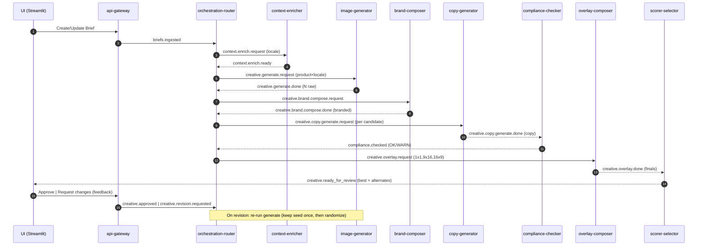
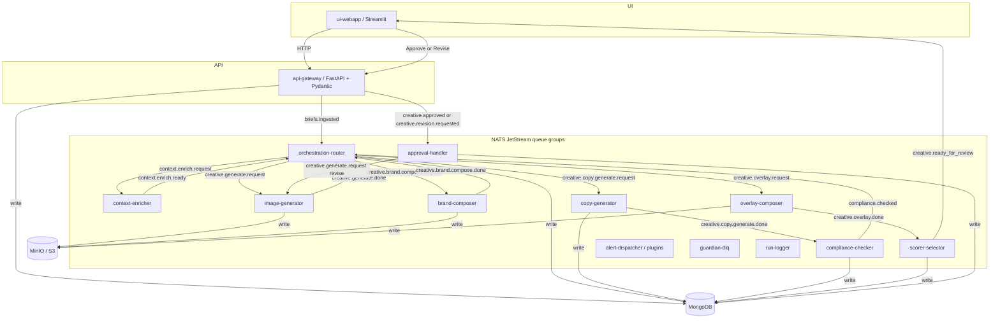

awesome. here’s the architecture doc section exactly as you asked: “how it works (per-locale)” first, the sequence mermaid diagram **right below**, then the containers diagram, then the **Service Responsibilities & I/O matrix**.

---

# How it works (per locale) — quick explainer

1. **Create / update brief** in Streamlit → FastAPI validates & stores → emits **`briefs.ingested`**.
2. **Router** fans out **one locale at a time**: sends **`context.enrich.request`**.
3. **Context-enricher** builds a **Context Pack** (culture, tone, do/don’t, legal/banned) → **`context.enrich.ready`**.
4. **Router** fans out **per product** (for this locale): **`creative.generate.request`** with the Context Pack.
5. **Image-generator** makes **N raw candidates** (OpenAI-compatible or custom provider), stores in S3 `/raw/` → **`creative.generate.done`**.
6. **Router** asks **Brand-composer** to add logo/accents → writes `*_branded.*` to S3 `/branded/` → **`creative.brand.compose.done`**.
7. **Router** asks **Copy-generator** to create **localized short copy** using the **branded image + context** → **`creative.copy.generate.done`**.
8. **Compliance-checker** flags banned/legal issues (**warn-only**) → **`compliance.checked`** (+ optional UI alert).
9. **Router** requests **Overlay-composer** to render copy onto the image → writes `/final/1x1|9x16|16x9/` → **`creative.overlay.done`**.
10. **Scorer-selector** ranks candidates & chooses the **best per locale** (keeps alternates) → **`creative.ready_for_review`**.
11. **UI** shows best+alternates → user **Approves** or **Requests changes**.
12. **Approval-handler**:

* **Approved** → finalizes in Mongo (+ optional ops alert).
* **Revision** → re-triggers **`creative.generate.request`** (first revision keeps seed; later randomizes).

13. Any step failing after retries publishes **`dlq.creative.<step>`**; **Guardian** notifies via pluggable alert sinks.

## Sequence (per product × locale)

## Containers & message flow (topology)

---

# Service Responsibilities & I/O matrix

> Queue groups ensure only **one** replica handles each message (e.g., `q.image`). Retries: 3 with backoff; final failure → `dlq.creative.<step>`; **Guardian** alerts.

| Service (container)         | Purpose                                                   | **Listens**                                                                                                                                    | **Publishes**                                                                                                                                         | Mongo (R/W)                        | S3 (R/W)                                       |
| --------------------------- | --------------------------------------------------------- | ---------------------------------------------------------------------------------------------------------------------------------------------- | ----------------------------------------------------------------------------------------------------------------------------------------------------- | ---------------------------------- | ---------------------------------------------- |
| **S1 api-gateway**          | REST for UI; validate & persist briefs; emit control msgs | —                                                                                                                                              | `briefs.ingested`, `creative.revision.requested`, `creative.approved`                                                                                 | **W** campaigns, runs(init)        | —                                              |
| **S2 ui-webapp**            | Human UI (briefs, review, approvals), live alerts         | `alerts.ui` (broadcast), `creative.ready_for_review` (broadcast)                                                                               | — (uses API)                                                                                                                                          | **R** campaigns, variants          | **R** via signed URLs                          |
| **S3 context-enricher**     | Build Context Pack per locale                             | `context.enrich.request` (q.context)                                                                                                           | `context.enrich.ready` (or `alerts.ops` on WARN/ERROR)                                                                                                | **W** runs.events                  | —                                              |
| **S4 orchestration-router** | Fan-out steps when ready                                  | `briefs.ingested` (q.router), `context.enrich.ready`, `creative.generate.done`, `creative.brand.compose.done`, `compliance.checked` (q.router) | `context.enrich.request`, `creative.generate.request`, `creative.brand.compose.request`, `creative.copy.generate.request`, `creative.overlay.request` | **W** runs.events                  | —                                              |
| **S5 image-generator**      | Generate N raw candidates via provider adapters           | `creative.generate.request` (q.image)                                                                                                          | `creative.generate.progress`(opt), `creative.generate.done`                                                                                           | **W** variants(candidates)         | **W** `/raw/*`                                 |
| **S6 brand-composer**       | Add logo/accents (non-destructive)                        | `creative.brand.compose.request` (q.brand)                                                                                                     | `creative.brand.compose.done`                                                                                                                         | **W** variants.update(branded)     | **R** `/raw/*` → **W** `/branded/*`            |
| **S7 copy-generator**       | Localized short copy per branded candidate                | `creative.copy.generate.request` (q.copy)                                                                                                      | `creative.copy.generate.done`                                                                                                                         | **W** variants.update(text)        | **R** `/branded/*`                             |
| **S8 compliance-checker**   | Banned/legal checks (warn-only)                           | `creative.copy.generate.done` (q.compliance)                                                                                                   | `compliance.checked`, `alerts.ui`(WARN)                                                                                                               | **W** variants.update(compliance)  | —                                              |
| **S9 overlay-composer**     | Render copy; export 1:1, 9:16, 16:9                       | `creative.overlay.request` (q.overlay)                                                                                                         | `creative.overlay.done`                                                                                                                               | **W** variants.update(final_uris)  | **R** `/branded/*` → **W** `/final/<aspect>/*` |
| **S10 scorer-selector**     | Score & choose best per locale                            | `creative.overlay.done` (q.select)                                                                                                             | `creative.ready_for_review` (+(opt) `alerts.ui`)                                                                                                      | **W** variants.update(scores,best) | **R** `/final/*`                               |
| **S11 approval-handler**    | Action approvals & revisions                              | `creative.revision.requested`, `creative.approved` (q.approval)                                                                                | (revise) `creative.generate.request`, (approved) `alerts.ops`                                                                                         | **W** variants.status, runs.events | —                                              |
| **S12 alert-dispatcher**    | Pluggable sinks (email/SMS/webhook/NATS)                  | `alerts.*` (q.alerts)                                                                                                                          | external sends (+(opt) `alerts.delivery_failed`)                                                                                                      | **W** runs.events                  | —                                              |
| **S13 guardian-dlq**        | Watch DLQs; enrich & escalate                             | `dlq.creative.*` (q.guardian)                                                                                                                  | `alerts.ops` (ERROR)                                                                                                                                  | **W** runs.events                  | —                                              |
| **S14 run-logger**          | Central audit aggregation                                 | `*.done`, `*.failed`, `alerts.*` (q.logger)                                                                                                    | —                                                                                                                                                     | **W** runs, events                 | —                                              |

