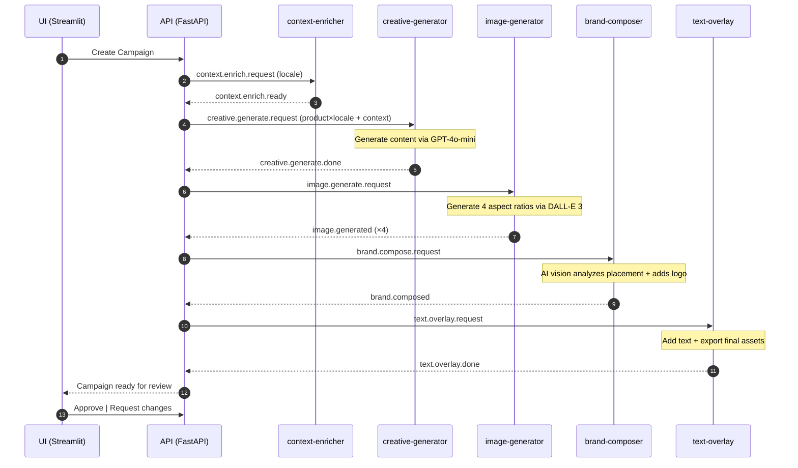
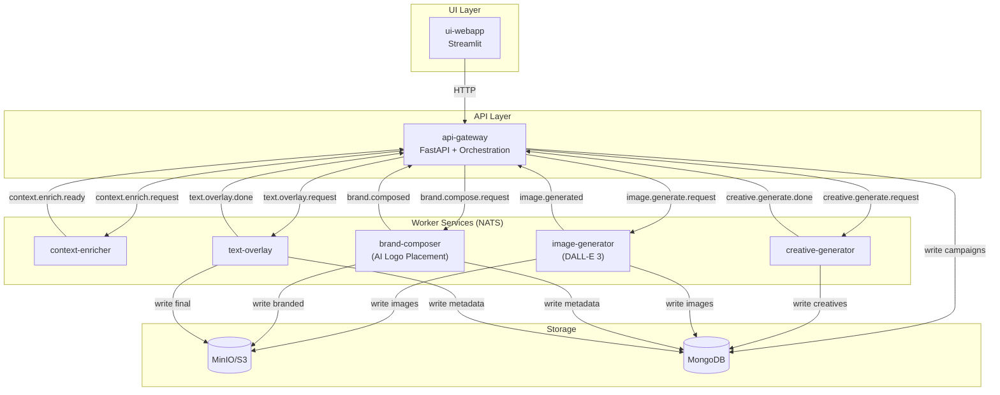

# 🏗️ Architecture Overview

## Design Philosophy

Right-sized microservices with event-driven communication. Built for production scale, tested with Docker Compose.

**Key principles**:
- 🔄 **Event-driven**: NATS JetStream for reliable, decoupled messaging
- 🤖 **AI-powered**: OpenAI DALL-E 3 for images, GPT-4o-mini for text & vision
- 🎯 **Single responsibility**: Each service does one thing well
- ✅ **Production-ready**: Health checks, retries, structured logging

Each service scales independently and communicates via NATS pub/sub for high throughput and low latency. With Kubernetes auto-scaling and NATS JetStream, this architecture handles thousands of campaigns daily.

> **For evaluators**: See [why-microservices.md](why-microservices.md) for architectural trade-offs and [simplified-alternative.md](simplified-alternative.md) for a monolithic approach.

---

## Architecture: 5 Worker Services + API + UI

### Core Services

1. **api** - FastAPI REST API + orchestration
2. **web** - Streamlit UI for campaign creation & monitoring

### Worker Services (NATS Event-Driven)

3. **context-enricher** - Builds locale-specific context packs
4. **creative-generator** - Generates creative content using GPT-4o-mini
5. **image-generator** - Generates images using DALL-E 3
6. **brand-composer** - Adds logo using AI-powered placement (GPT-4o-mini vision)
7. **text-overlay** - Adds text and exports multiple aspect ratios

---

## 🔄 How It Works (Per Locale)

1. 📝 **User creates campaign** in Streamlit → API validates & stores → publishes `briefs.ingested`
2. 🌍 **Context enricher** builds locale-specific context (culture, tone, legal) → `context.enrich.ready`
3. ✍️ **Creative generator** writes campaign content using GPT-4o-mini → `creative.generate.done`
4. 🎨 **Image generator** creates 4 images (one per aspect ratio) using DALL-E 3 → `image.generated`
5. 🎯 **Brand composer** uses AI vision to find perfect logo spot, adds branding → `brand.composed`
6. 📐 **Text overlay** adds campaign text, exports all formats → `text.overlay.done`
7. ✅ **User reviews** in UI → Approves or requests changes
8. 🔁 **Automatic retries** if any step fails (up to 3 times)

---

## Sequence Diagram (Simplified)



---

## Containers & Message Flow



---

## Service Matrix

| Service | Purpose | Technology | Listens | Publishes | Notes |
|---------|---------|------------|---------|-----------|-------|
| **api** | REST API + orchestration | FastAPI | — | All NATS events | Coordinates workflow |
| **web** | Campaign creation UI | Streamlit | — | HTTP to API | User interface |
| **context-enricher** | Locale context packs | GPT-4o-mini | `context.enrich.request` | `context.enrich.ready` | Culture, tone, legal |
| **creative-generator** | Creative content | GPT-4o-mini | `creative.generate.request` | `creative.generate.done` | Generates copy |
| **image-generator** | Image generation | DALL-E 3 | `creative.generate.done` | `image.generated` | 4 aspect ratios |
| **brand-composer** | Logo placement | GPT-4o-mini vision + PIL | `image.generated` | `brand.composed` | AI-powered placement |
| **text-overlay** | Text + export | PIL | `brand.composed` | `text.overlay.done` | Final assets to S3 |

---

## API Orchestration Logic

### Why API Handles Orchestration (Not Separate Service)

**Traditional**: Separate orchestration-router service  
**Our approach**: Orchestration logic in api-gateway

**Rationale**:
- **Simplicity**: Fewer services to deploy/monitor
- **Lower latency**: No extra message hop
- **Sufficient for POC volume**: <10K campaigns/day

**When to extract orchestrator**:
- Volume >10K campaigns/day
- Complex workflows (approval trees, parallel branches)
- Multiple API gateways need same orchestration

### Example: API Gateway Orchestration

```python
# In api-gateway/main.py
class CampaignOrchestrator:
    async def execute_campaign(self, brief: CampaignBrief):
        for locale in brief.target_locales:
            # 1. Enrich context
            context = await self.enrich_context(brief, locale)
            
            # 2. Generate images per product
            for product in brief.products:
                image_result = await self.generate_image(product, locale, context)
                
                # 3. Apply branding
                branded = await self.apply_branding(image_result, brief.brand)
                
                # 4. Generate copy
                copy = await self.generate_copy(branded, locale, context)
                
                # 5. Overlay and export
                finals = await self.overlay_and_export(branded, copy, brief.output)
                
                # 6. Save to DB
                await self.save_variant(brief.campaign_id, product, locale, finals)
        
        # 7. Notify UI
        await self.publish_ready_for_review(brief.campaign_id)
    
    async def enrich_context(self, brief, locale):
        await nats.publish("context.enrich.request", {
            "campaign_id": brief.campaign_id,
            "locale": locale,
            "audience": brief.audience
        })
        
        response = await nats.request("context.enrich.ready", timeout=30)
        return response.context_pack
    
    # Similar for other steps...
```

---

## NATS Subjects (Simplified)

| Subject | Publisher | Subscriber | Purpose |
|---------|-----------|------------|---------|
| `briefs.ingested` | api-gateway | (internal trigger) | Campaign submitted |
| `context.enrich.request` | api-gateway | context-enricher | Request context pack |
| `context.enrich.ready` | context-enricher | api-gateway | Context pack ready |
| `creative.generate.request` | api-gateway | image-generator | Generate images |
| `creative.generate.done` | image-generator | api-gateway | Images generated |
| `creative.brand.compose.request` | api-gateway | brand-composer | Add branding |
| `creative.brand.compose.done` | brand-composer | api-gateway | Branding done |
| `creative.copy.generate.request` | api-gateway | copy-generator | Generate copy |
| `creative.copy.generate.done` | copy-generator | api-gateway | Copy generated |
| `creative.overlay.request` | api-gateway | overlay-composer | Overlay + export |
| `creative.overlay.done` | overlay-composer | api-gateway | Export done |
| `creative.ready_for_review` | api-gateway | ui-webapp | Ready for approval |
| `creative.approved` | api-gateway | (internal) | Campaign approved |
| `creative.revision.requested` | api-gateway | (triggers re-gen) | Request changes |
| `dlq.creative.*` | any worker | guardian-dlq | Failure escalation |
| `alerts.ops` | guardian-dlq | external (email/Slack) | Operational alerts |

---

## Scaling Properties

### Horizontal Scaling Example

```yaml
# K8s HPA for image-generator
apiVersion: autoscaling/v2
kind: HorizontalPodAutoscaler
metadata:
  name: image-generator
spec:
  scaleTargetRef:
    name: image-generator
  minReplicas: 2
  maxReplicas: 20
  metrics:
  - type: External
    external:
      metric:
        name: nats_consumer_num_pending
        selector:
          matchLabels:
            subject: creative.generate.request
      target:
        averageValue: "5"  # Scale if >5 pending per pod
```

**Result**: Auto-scale from 2 → 20 pods during peak, back to 2 overnight.

### Cost Optimization

**Scenario**: 1,000 campaigns/month, 2 products each, 3 locales

- **api-gateway**: 2 vCPU, 4GB = $50/month (always on)
- **image-generator**: 4 vCPU, 16GB, GPU = $300/month × 40% duty = $120/month
- **Other services**: 1 vCPU, 2GB × 4 = $80/month
- **Infrastructure**: NATS, MongoDB, MinIO = $50/month

**Total**: ~$300/month vs $500 for monolithic always-on instance

---

## Technology Stack

| Layer | Technology | Purpose |
|-------|-----------|---------|
| **Frontend** | Streamlit | Campaign creation UI |
| **API** | FastAPI | REST API + orchestration |
| **Message Bus** | NATS JetStream | Event-driven communication |
| **Database** | MongoDB | Campaign metadata |
| **Storage** | MinIO/S3 | Asset storage |
| **AI/ML** | OpenAI (DALL-E 3, GPT-4o-mini) | Image generation + text + vision |
| **Image Processing** | PIL (Pillow) | Logo overlay, text rendering |
| **Infrastructure** | Docker Compose | Local development |

---

## Further Reading

- [Why Microservices?](why-microservices.md) - Architectural trade-offs
- [Simplified Alternative](simplified-alternative.md) - Monolithic Python app (300 lines)
- [Schemas Reference](schemas.md) - API models, NATS contracts, MongoDB schemas
- [AI Logo Placement](ai-logo-placement.md) - How GPT-4o-mini vision analyzes images
