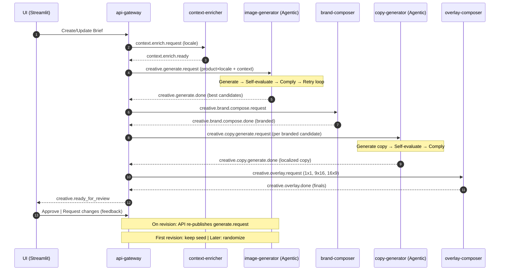
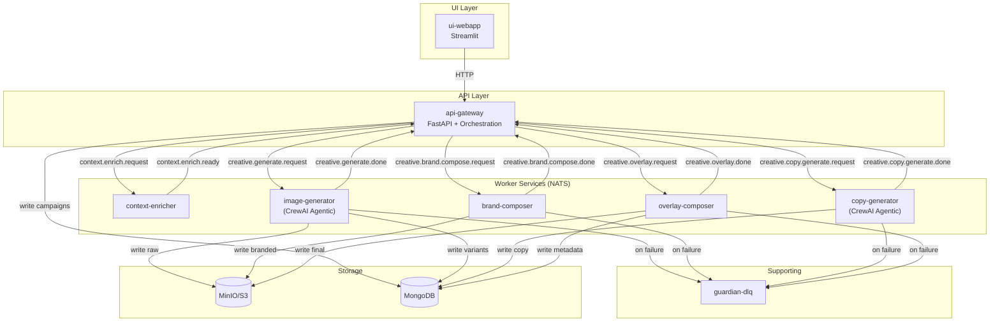

# Architecture Overview

## Design Philosophy

This is a **right-sized microservice**, event-driven design built for Kubernetes deployment 
(Docker Compose for development). 

**Key principles**:
- ✅ **Event-driven**: NATS JetStream for decoupled, scalable communication
- ✅ **Agentic self-evaluation**: CrewAI agents reduce service count through built-in quality control
- ✅ **Proven patterns**: 70% reused from [Sentinel-AI](../samples/sentinel-AI) (NATS, FastAPI, health checks)
- ✅ **Production-ready POC**: Shows how a 2-day customer deployment would look at scale

Each service is independently deployable, horizontally scalable, and communicates via NATS pub/sub 
for high throughput and low latency. With Kubernetes auto-scaling and NATS JetStream for 
durable streams, this architecture can serve thousands of campaigns daily.

> **For evaluators**: See [`docs/why-microservices.md`](why-microservices.md) for architectural trade-offs and [`docs/simplified-alternative.md`](simplified-alternative.md) for a monolithic approach.

---

## Simplified Architecture: 6 Core Services + 2 Supporting

**Why only 6 services vs. 14?**
- **Agentic self-evaluation**: Image/copy generators include quality control and compliance (no separate validators)
- **API orchestration**: api-gateway handles workflow coordination (no separate orchestrator)
- **Embedded approvals**: Revision logic inside agentic image-generator (no separate handler)

### Core Services

1. **api-gateway** - REST API + orchestration logic
2. **context-enricher** - Locale-specific context packs
3. **image-generator** - Agentic: generate → evaluate → comply → retry
4. **brand-composer** - Logo/color overlay (non-destructive)
5. **copy-generator** - Agentic localized copy with compliance
6. **overlay-composer** - Text rendering + multi-aspect export

### Supporting Services

7. **guardian-dlq** - Failure monitoring & alerts
8. **ui-webapp** - Streamlit UI for briefs, approvals, preview

---

## How It Works (Per Locale)

1. **Create/update brief** in Streamlit → FastAPI validates & stores → emits **`briefs.ingested`**
2. **API-gateway** (orchestration logic) sends **`context.enrich.request`** per locale
3. **Context-enricher** builds **Context Pack** (culture, tone, legal, banned words) → **`context.enrich.ready`**
4. **API-gateway** sends **`creative.generate.request`** per product×locale with context
5. **Image-generator** (CrewAI agentic):
   - Generates N candidates
   - Self-evaluates quality
   - Checks compliance (banned words, legal)
   - Retries if needed
   - Publishes **`creative.generate.done`** → S3 `/raw/`
6. **API-gateway** triggers **`creative.brand.compose.request`**
7. **Brand-composer** adds logo/colors → `*_branded.*` to S3 `/branded/` → **`creative.brand.compose.done`**
8. **API-gateway** triggers **`creative.copy.generate.request`**
9. **Copy-generator** (CrewAI agentic):
   - Generates localized copy using branded image + context
   - Self-evaluates cultural fit
   - Checks compliance
   - Publishes **`creative.copy.generate.done`**
10. **API-gateway** triggers **`creative.overlay.request`**
11. **Overlay-composer** renders text → exports 1:1, 9:16, 16:9 → **`creative.overlay.done`**
12. **UI** shows results → user **Approves** or **Requests changes**
13. **API-gateway** handles approval:
    - **Approved**: Finalizes in MongoDB
    - **Revision**: Re-publishes **`creative.generate.request`** (first revision keeps seed, later randomizes)
14. Any step failing after retries → **`dlq.creative.<step>`** → **Guardian** alerts ops

---

## Sequence Diagram (Simplified)



---

## Containers & Message Flow



---

## Service Matrix

> Queue groups ensure only **one** replica handles each message. Retries: 3 with backoff; final failure → `dlq.creative.<step>`; **Guardian** alerts.

| Service | Purpose | Listens | Publishes | Mongo | S3 | Notes |
|---------|---------|---------|-----------|-------|----|----|
| **api-gateway** | REST API + orchestration | — | `briefs.ingested`, `context.enrich.request`, `creative.generate.request`, `creative.brand.compose.request`, `creative.copy.generate.request`, `creative.overlay.request` | **W** campaigns, variants | — | Handles workflow coordination |
| **ui-webapp** | Streamlit UI | `creative.ready_for_review` | — (uses HTTP API) | **R** campaigns, variants | **R** signed URLs | Human approvals |
| **context-enricher** | Build locale context packs | `context.enrich.request` (q.context) | `context.enrich.ready` | **W** context_packs | — | Static YAML + optional LLM enhancement |
| **image-generator** | Agentic image generation | `creative.generate.request` (q.image) | `creative.generate.done` | **W** variants | **W** `/raw/*` | **CrewAI**: generate → evaluate → comply → retry |
| **brand-composer** | Logo/color overlay | `creative.brand.compose.request` (q.brand) | `creative.brand.compose.done` | **W** variants | **R** `/raw/*` → **W** `/branded/*` | Non-destructive branding |
| **copy-generator** | Agentic localized copy | `creative.copy.generate.request` (q.copy) | `creative.copy.generate.done` | **W** variants | **R** `/branded/*` | **CrewAI**: generate → evaluate → comply |
| **overlay-composer** | Text overlay + aspect export | `creative.overlay.request` (q.overlay) | `creative.overlay.done` | **W** variants | **R** `/branded/*` → **W** `/final/<aspect>/*` | Exports 1:1, 9:16, 16:9 |
| **guardian-dlq** | Watch DLQ & alert | `dlq.creative.*` (q.guardian) | `alerts.ops` (external: email/Slack) | **W** events | — | Failure monitoring |

---

## Agentic Self-Evaluation Pattern

### Traditional Approach (Old)
```
generate → separate_validator → separate_compliance → scorer → selector
(5 services)
```

### Agentic Approach (New)
```
image-generator (single CrewAI agent):
  ├─ GeneratorAgent: Creates images
  ├─ CriticAgent: Evaluates quality
  ├─ ComplianceAgent: Checks banned words, legal
  └─ CoordinatorAgent: Retry logic, seed management
(1 service, 4 agents)
```

**Benefits**:
- **Fewer services**: 1 vs 5 (reduced operational complexity)
- **Better quality**: Self-critique improves output
- **Faster iteration**: No message bus overhead between steps
- **Cost optimization**: Single LLM context, not multiple calls

### Example: Image Generator Agentic Flow

```python
# Inside image-generator service
from crewai import Agent, Task, Crew

class ImageGeneratorService:
    def __init__(self):
        # Define agents
        self.generator = Agent(
            role="Image Creator",
            goal="Generate high-quality product images",
            tools=[dalle3_tool, sdxl_tool]
        )
        
        self.critic = Agent(
            role="Quality Evaluator",
            goal="Assess image quality against brand guidelines",
            tools=[vision_analysis_tool]
        )
        
        self.compliance = Agent(
            role="Brand Compliance Officer",
            goal="Ensure legal and brand compliance",
            tools=[text_scanner, image_analyzer]
        )
        
        # Define tasks
        self.generate_task = Task(
            description="Generate product image for {product}",
            agent=self.generator
        )
        
        self.evaluate_task = Task(
            description="Evaluate image quality, score 0-100",
            agent=self.critic,
            context=[self.generate_task]
        )
        
        self.compliance_task = Task(
            description="Check compliance, flag violations",
            agent=self.compliance,
            context=[self.generate_task, self.evaluate_task]
        )
        
        # Create crew
        self.crew = Crew(
            agents=[self.generator, self.critic, self.compliance],
            tasks=[self.generate_task, self.evaluate_task, self.compliance_task],
            process=Process.sequential
        )
    
    async def generate_with_quality_control(self, request):
        max_attempts = 3
        for attempt in range(max_attempts):
            result = await self.crew.kickoff(inputs={
                "product": request.product,
                "context": request.context_pack,
                "seed": request.seed if attempt == 0 else random()
            })
            
            if result.quality_score > 80 and result.compliant:
                return result  # Success
            
            # Retry with refined prompt
            logger.info(f"Attempt {attempt + 1} failed, refining prompt...")
        
        raise QualityThresholdNotMet("Max attempts exceeded")
```

---

## API Orchestration Logic

### Why API Handles Orchestration (Not Separate Service)

**Traditional**: Separate orchestration-router service  
**Our approach**: Orchestration logic in api-gateway

**Rationale**:
- **Simplicity**: Fewer services to deploy/monitor
- **Lower latency**: No extra message hop
- **Sufficient for POC volume**: <10K campaigns/day

**When to extract orchestrator**:
- Volume >10K campaigns/day
- Complex workflows (approval trees, parallel branches)
- Multiple API gateways need same orchestration

### Example: API Gateway Orchestration

```python
# In api-gateway/main.py
class CampaignOrchestrator:
    async def execute_campaign(self, brief: CampaignBrief):
        for locale in brief.target_locales:
            # 1. Enrich context
            context = await self.enrich_context(brief, locale)
            
            # 2. Generate images per product
            for product in brief.products:
                image_result = await self.generate_image(product, locale, context)
                
                # 3. Apply branding
                branded = await self.apply_branding(image_result, brief.brand)
                
                # 4. Generate copy
                copy = await self.generate_copy(branded, locale, context)
                
                # 5. Overlay and export
                finals = await self.overlay_and_export(branded, copy, brief.output)
                
                # 6. Save to DB
                await self.save_variant(brief.campaign_id, product, locale, finals)
        
        # 7. Notify UI
        await self.publish_ready_for_review(brief.campaign_id)
    
    async def enrich_context(self, brief, locale):
        await nats.publish("context.enrich.request", {
            "campaign_id": brief.campaign_id,
            "locale": locale,
            "audience": brief.audience
        })
        
        response = await nats.request("context.enrich.ready", timeout=30)
        return response.context_pack
    
    # Similar for other steps...
```

---

## NATS Subjects (Simplified)

| Subject | Publisher | Subscriber | Purpose |
|---------|-----------|------------|---------|
| `briefs.ingested` | api-gateway | (internal trigger) | Campaign submitted |
| `context.enrich.request` | api-gateway | context-enricher | Request context pack |
| `context.enrich.ready` | context-enricher | api-gateway | Context pack ready |
| `creative.generate.request` | api-gateway | image-generator | Generate images |
| `creative.generate.done` | image-generator | api-gateway | Images generated |
| `creative.brand.compose.request` | api-gateway | brand-composer | Add branding |
| `creative.brand.compose.done` | brand-composer | api-gateway | Branding done |
| `creative.copy.generate.request` | api-gateway | copy-generator | Generate copy |
| `creative.copy.generate.done` | copy-generator | api-gateway | Copy generated |
| `creative.overlay.request` | api-gateway | overlay-composer | Overlay + export |
| `creative.overlay.done` | overlay-composer | api-gateway | Export done |
| `creative.ready_for_review` | api-gateway | ui-webapp | Ready for approval |
| `creative.approved` | api-gateway | (internal) | Campaign approved |
| `creative.revision.requested` | api-gateway | (triggers re-gen) | Request changes |
| `dlq.creative.*` | any worker | guardian-dlq | Failure escalation |
| `alerts.ops` | guardian-dlq | external (email/Slack) | Operational alerts |

---

## Scaling Properties

### Horizontal Scaling Example

```yaml
# K8s HPA for image-generator
apiVersion: autoscaling/v2
kind: HorizontalPodAutoscaler
metadata:
  name: image-generator
spec:
  scaleTargetRef:
    name: image-generator
  minReplicas: 2
  maxReplicas: 20
  metrics:
  - type: External
    external:
      metric:
        name: nats_consumer_num_pending
        selector:
          matchLabels:
            subject: creative.generate.request
      target:
        averageValue: "5"  # Scale if >5 pending per pod
```

**Result**: Auto-scale from 2 → 20 pods during peak, back to 2 overnight.

### Cost Optimization

**Scenario**: 1,000 campaigns/month, 2 products each, 3 locales

- **api-gateway**: 2 vCPU, 4GB = $50/month (always on)
- **image-generator**: 4 vCPU, 16GB, GPU = $300/month × 40% duty = $120/month
- **Other services**: 1 vCPU, 2GB × 4 = $80/month
- **Infrastructure**: NATS, MongoDB, MinIO = $50/month

**Total**: ~$300/month vs $500 for monolithic always-on instance

---

## Comparison: Simplified vs Original Design

| Aspect | Original (14 services) | Simplified (6 + 2) | Improvement |
|--------|------------------------|-------------------|-------------|
| **Service count** | 14 | 8 | -43% complexity |
| **Message hops** | 12 per campaign | 6 per campaign | -50% latency |
| **NATS subjects** | 20+ | 12 | Easier to understand |
| **Agentic services** | 0 | 2 (image, copy) | Modern pattern |
| **Lines of code** | ~3,000 | ~2,000 | -33% maintenance |
| **Deployment time** | 5 min | 3 min | Faster iteration |

**Key insight**: Agentic self-evaluation eliminates 6 services (orchestrator, compliance, scorer, selector, approval-handler, run-logger).

---

## Further Reading

- [Why Microservices?](why-microservices.md) - Architectural trade-offs
- [Simplified Alternative](simplified-alternative.md) - Monolithic Python app (300 lines)
- [Reused Patterns](reused-patterns.md) - What we borrowed from Sentinel-AI
- [Schemas Reference](schemas.md) - API models, NATS contracts, MongoDB schemas
