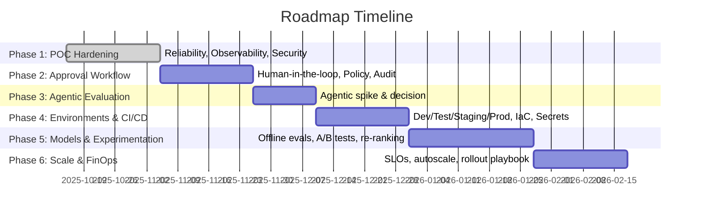

# AI Product Roadmap (CreativeCampaign-Agent)

This roadmap converts your phases into a production-grade plan for a real AI system. It adds deliverables, exit criteria, metrics, governance, and rollout strategies aligned with industry best practices.

References informing this roadmap:
- Visium: From PoC to production best practices (scaling, MLOps, compliance)
- Microsoft LLMOps checklists (monitoring, evaluation, capacity planning)
- Gartner/enterprise AI roadmapping guidance (workstreams & maturity)
- General GenAI roadmap articles (6-phase frameworks)

---

## High-level Timeline

Time is indicative for a small team (2–4 engineers). Phases can overlap where safe (e.g., start IaC during Phase 2).

---

## Phase 1: POC Hardening → MVP

Objective: Turn the working prototype into a robust, secure MVP.

- Deliverables
  - **Reliability**: retries, idempotency, DLQs for NATS JetStream; structured error taxonomy.
  - **Observability**: OpenTelemetry traces across `api/`, `context-enricher/`, `creative-generator/`, `image-generator/`, `brand-composer/`, `text-overlay/`. Central logs, request IDs, correlation IDs.
  - **Security**: API auth (API keys/JWT), service-to-service secrets via Vault/SSM, network policies.
  - **Data**: MongoDB schema migration scripts; PII tagging; data retention policy. S3 object lifecycle rules.
  - **Quality baselines**: Create evaluation set and rubric for content quality, safety, and correctness.
  - **Cost baselines**: Token/logit/compute telemetry; cost-per-asset dashboard.

- Exit Criteria
  - >99% success for single-locale campaign happy-path.
  - P95 end-to-end latency per asset ≤ 90s (generation + compose + overlay).
  - Zero critical vulns in dependency scan. Secrets not in repo.
  - Dashboards live: success rate, latency, cost, safety violations.

- Metrics
  - Success rate, P95 latency by stage, cost per image and per campaign, content safety violation rate, hallucination/off-policy rate (manual QA set).

- Risks & Mitigations
  - DALL·E rate limits → backoff + queue; preemption-safe idempotency; exponential retry with jitter.
  - LLM drift → snapshot prompts and versions; lock configs per release.

---

## Phase 2: Implement the Approval Process (Human-in-the-Loop)

Objective: Add a controlled, auditable human review for sensitive outputs.

- Deliverables
  - **Workflow**: Draft → Review → Approved/Changes Requested states per asset.
  - **Roles**: Creator, Reviewer, Approver with RBAC.
  - **UI**: Streamlit review console: side-by-side assets, metadata (prompt, costs), approve/request changes.
  - **Policy & Safety**: Brand policy checks, content safety heuristics (keywords, unsafe categories). Escalation rules.
  - **Auditability**: Immutable approval logs; who/when/why; versioning of assets and prompts.

- Exit Criteria
  - 100% of assets flow through approval for ≥1 pilot customer/brand.
  - Audit logs pass internal compliance review.
  - Turnaround time P50 ≤ 2h for business-hours queue.

- Metrics
  - Approval rate, revision rate, reviewer SLA, reasons for rejection, safety issues per 100 assets.

- Risks & Mitigations
  - Approval bottlenecks → batching, priority queues, reviewer load dashboard.
  - Policy ambiguity → living policy doc + examples; reviewer training.

---

## Phase 3: Assess Agentic Patterns for LLM Services

Objective: Decide whether to transform LLM services into agentic workflows (planning, tool-use, retries) for quality/maintainability gains.

- Scope
  - Candidates: `context-enricher`, `creative-generator`, `brand-composer` (vision analysis step).
  - Agentic features to test: planning, critique-and-rewrite, tool use (knowledge retrieval, banned-word checker), self-consistency, multi-pass reasoning, constrained decoding/JSON schema.

- Deliverables
  - Controlled experiments vs. current non-agentic pipelines on identical eval sets.
  - Cost/latency deltas; quality uplift measured via rubric + human rating.
  - Risk assessment (non-determinism, longer tail latencies, complexity).

- Exit Criteria
  - Adopt agentic only if: +≥10% quality improvement at ≤25% cost increase and P95 ≤ +20% latency; otherwise keep current design and cherry-pick only valuable sub-techniques (e.g., critique pass).

- Metrics
  - Human-rated quality, brand compliance, locality correctness; P95 latency; tokens per asset; failure modes.

---

## Phase 4: Infrastructure (Dev, Test, Staging, Production)

Objective: Standardize environments and delivery with strong safety rails.

- Deliverables
  - **IaC**: Terraform for VPC, EKS/GKE/Kubernetes, NATS JetStream, MongoDB (managed), MinIO/S3, observability stack.
  - **CI/CD**: Build, scan, SBOM, unit/integration tests, ephemeral preview envs, automated migrations, feature flags.
  - **Secrets**: Vault/SSM + short-lived credentials; per-env OpenAI keys and quotas.
  - **Release safety**: Blue/green or canary; config-as-code for prompts and model versions; rollout/rollback automation.
  - **Compliance**: Data residency, PII handling, DLP, access logs. Backup/restore tested.

- Exit Criteria
  - One-click promotion Dev → Test → Staging → Prod with gated approvals.
  - Disaster recovery drill passes (RPO ≤ 15m, RTO ≤ 60m).
  - Load test meets target: 50 concurrent campaigns, 200 assets/hour, SLOs green.

- Metrics
  - Deployment frequency, change failure rate, MTTR, pipeline lead time, DR test MTTR.

---

## Phase 5: Model Upgrades, A/B Tests, and Creative Re-Ranking

Objective: Safely evolve models and continuously optimize creative outcomes.

- Deliverables
  - **Eval Harness**: Offline evaluation datasets; regression tests for prompts and outputs; golden sets per locale.
  - **Experimentation**: A/B and bandit experiments for model versions, prompts, decoding params; guardrail tests.
  - **Reranking**: Generate k variants, rerank via secondary LLM or lightweight model using features (brand-terms coverage, locality cues, readability, predicted CTR proxy).
  - **Safety**: Automated policy checks pre-approval; toxicity/PII classifiers where applicable.

- Exit Criteria
  - Model upgrade playbook executed once with zero incidents; measurable uplift in at least one KPI without regressions on safety or cost.
  - Reranking improves human-rated quality by ≥8% at ≤10% latency hit.

- Metrics
  - CTR proxy/engagement proxy, human rating distribution, safety violations, cost delta per asset, win rate in A/B.

---

## Phase 6: Scale-out, FinOps, and Rollout Playbook

Objective: Operate at scale with predictable cost and safe releases.

- Deliverables
  - **SLOs & Alerts**: SLOs for success rate, latency, and approval SLA; on-call rotation and runbooks.
  - **Autoscaling & Queues**: HPA/KEDA on queue depth; concurrency controls; circuit breakers; per-tenant quotas.
  - **Caching**: Prompt and logo placement cache when applicable; presigned URL reuse.
  - **FinOps**: Per-tenant cost dashboards; budget alerts; model selection policy (quality/cost tiers); token limits.
  - **Rollout Playbook**: Canary %s, abort criteria, automated rollback, feature flags for model/prompt switches.

- Exit Criteria
  - Can process 10× current volume within SLOs; monthly cost within budget with alerts.
  - 3 consecutive safe canary releases with automated rollback tested.

- Metrics
  - Cost per campaign, infra utilization, queue wait times, throttle/rate-limit events, on-call toil.

---

## Cross-cutting Workstreams

- **Governance & Risk**: Model/Prompt registry; change review; incident postmortems.
- **Privacy & Compliance**: PII inventory, data minimization, DSR flows, retention & deletion.
- **Docs & Training**: Runbooks, reviewer handbook, policy examples, onboarding.
- **Security**: Threat modeling; pen tests; dependency scanning; SBOM.
- **Data Management**: Dataset versioning, synthetic data policies, dataset health monitors.

---

## Mapping to Current Codebase

- `src/context_enricher/`: add schema validation, retries, prompt registry (P1), candidate agentic plan/critique (P3), eval harness (P5).
- `src/creative_generator/`: multilingual eval set (P1), approval surface for reviewers (P2), reranking inputs (P5), A/B flags (P5).
- `src/image_generator/`: rate limiters + backoff (P1), prompt size policies (P5), cost guardrails (P6).
- `src/brand_composer/`: vision analysis logs + explainability (P1), safety checks (P2), agentic self-check (P3).
- `src/text_overlay/`: deterministic placement test suite (P1), batching & concurrency controls (P6).
- `infra/`: Terraform modules for NATS/MongoDB/S3/OTel (P4), canary manifests (P4/P6).

---

## RACI (example for Phase 2)

- Responsible: Engineering (backend), Designer (brand policy), Reviewer Leads
- Accountable: Product
- Consulted: Legal/Compliance, Data Science
- Informed: Customer Success, Sales

---

## KPIs Summary

- Quality: Human rating ≥ 4/5; policy compliance ≥ 99.5%; reranking win-rate.
- Delivery: Deployment frequency weekly; CFR < 15%; MTTR < 1h.
- Reliability: Success rate ≥ 99%; P95 E2E latency ≤ 90s/asset.
- Cost: Cost/asset and cost/campaign within budget; compute utilization ≥ 50%.

---

## Notes on Agentic Decision (Phase 3)

Adopt agentic patterns selectively. Prioritize critique-and-rewrite and constrained JSON outputs before full planners. Keep a non-agentic fallback path behind a feature flag.

---

## Rollback & Recovery

- Blue/green with automated health gates (success rate, latency, safety checks).
- Prompt/model version pinning; rollback within minutes.
- Regular DR drills (quarterly) with documented RTO/RPO outcomes.
