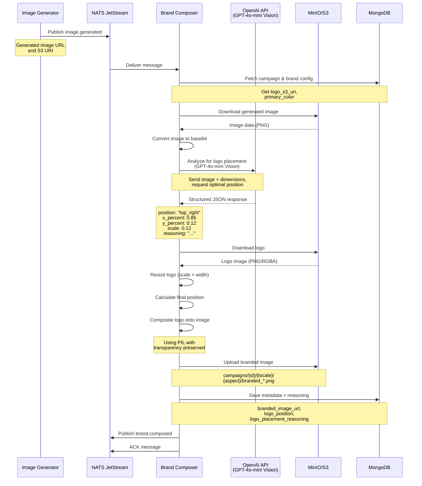

# Brand Composer Service

## Purpose

The **Brand Composer** adds brand elements (logo and colors) to generated images using **AI-powered logo placement**. It uses GPT-4o-mini's vision capabilities to analyze each image and determine the optimal logo position that doesn't obscure important visual elements.

## What It Does

1. **Receives** generated images from Image Generator
2. **Downloads** image from presigned URL
3. **Analyzes** image using GPT-4o-mini Vision API to find optimal logo placement
4. **Downloads** logo from S3
5. **Composites** logo onto image at AI-determined position
6. **Applies** brand colors (optional color grading)
7. **Uploads** branded image to S3
8. **Saves** metadata including AI reasoning
9. **Publishes** event to trigger text overlay

## Technology

- **AI Model:** GPT-4o-mini with Vision API
- **Image Processing:** PIL (Pillow) for compositing
- **Input:** Generated image + logo + brand colors
- **Output:** Branded image with intelligently-placed logo

---

## AI Logo Placement: How It Works

### The Challenge

Traditional rule-based logo placement uses fixed positions (e.g., "top-right corner") which can:
- ❌ Cover important visual elements (products, faces)
- ❌ Have poor contrast with background
- ❌ Look unnatural or forced
- ❌ Not adapt to different image compositions

### The Solution: GPT-4o-mini Vision

The service uses **AI vision analysis** to intelligently place logos:

1. **Converts image to base64** for Vision API
2. **Sends to GPT-4o-mini** with detailed analysis prompt
3. **Receives structured JSON** with optimal position, size, and reasoning
4. **Applies logo** using PIL at the recommended coordinates

---

## LLM Prompt (Vision Analysis)

```
You are an expert brand designer analyzing a product marketing image to find the BEST position for a brand logo.

IMAGE DIMENSIONS: {width}x{height} pixels

CRITICAL CONSTRAINT: Logo MUST be placed in the UPPER HALF of the image (y_percent < 0.50) 
because campaign text will be placed at the bottom.

YOUR TASK: Analyze the UPPER HALF of the image and find the optimal position and size for a brand logo that:
1. Does NOT cover or obscure important visual elements (products, faces, key imagery)
2. Has good contrast and visibility
3. Feels natural and professionally placed
4. Maintains brand prominence without being intrusive
5. STAYS IN TOP 50% (y_percent must be between 0.05 and 0.45)

STEP-BY-STEP ANALYSIS:

1. SCAN UPPER HALF (top 50%):
   - Identify visual elements in y: 0 to {int(height * 0.5)}px
   - Note pixel locations of: products, faces, text, decorative elements, focal points
   - Find empty/plain areas suitable for logo placement
   - Consider: top-left, top-center, top-right, middle-left, middle-right
   - Example: "Product centered at 400-600px, clear space in top-right corner 700-950px"

2. IDENTIFY BEST LOGO POSITION IN UPPER HALF:
   - Look for the largest continuous empty space with good visibility
   - Prefer corners or edges with plain/solid backgrounds
   - Best positions: top-right, top-left, top-center (all in upper 50%)
   - Avoid covering faces, products, or key visual elements
   - Estimate boundaries in pixels (x1, y1, x2, y2)
   - Example: "Best area: top-right corner x=700-950px, y=50-200px - plain background, good contrast"

3. CALCULATE LOGO SIZE:
   - Logo should be 8-18% of image width
   - Calculate: logo_size_px = {width} * scale (where scale is 0.08-0.18)
   - Smaller logos (0.08-0.11) for busy images or when placed over textured areas
   - Medium logos (0.11-0.14) for balanced placement
   - Larger logos (0.14-0.18) for plain backgrounds with lots of empty space
   - Example: "Plain background in corner → scale=0.12 → logo 123px for 1024px image"

4. CALCULATE EXACT POSITION (CENTER POINT):
   - Find CENTER of the chosen empty area IN THE UPPER HALF
   - Logo will be centered at: (x_percent, y_percent)
   - Ensure 30-60px margin from edges
   - x_percent: 0.0 (left edge) to 1.0 (right edge)
   - y_percent: 0.05 (near top) to 0.45 (middle) - MUST BE < 0.50
   - Example: "Top-right corner center at x_percent=0.85, y_percent=0.12"

5. VERIFY YOUR CHOICE:
   - Logo is in UPPER HALF? (y_percent < 0.50) ✓
   - Logo does NOT cover important visual elements? ✓
   - Logo has good contrast with background? ✓
   - Logo size is readable but not overwhelming? ✓
   - Position feels natural and professional? ✓
   - Adequate margin from edges (30-60px)? ✓

CRITICAL: Logo MUST be in top 50% of image. y_percent MUST be less than 0.50.

Respond with a JSON object in this EXACT format:
{
  "position": "top_right",
  "x_percent": 0.85,
  "y_percent": 0.12,
  "scale": 0.12,
  "reasoning": "Detailed explanation: why this position was chosen, what visual elements were avoided, 
               pixel coordinates, and confirmation that y < 50%"
}

Return ONLY the JSON object.
```

### Information Passed to GPT-4o-mini Vision

**Input Data:**
- `image_data` - Base64-encoded PNG image
- `width` - Image width in pixels
- `height` - Image height in pixels

**Pydantic Model (Structured Output):**
```python
class LogoPlacementResponse(BaseModel):
    position: str = Field(..., description="Logo position: bottom_right, bottom_left, top_right, or top_left")
    x_percent: float = Field(..., description="X coordinate as percentage of image width (0.0-1.0)")
    y_percent: float = Field(..., description="Y coordinate as percentage of image height (0.0-1.0)")
    scale: float = Field(..., description="Logo scale factor (0.08-0.25)")
    reasoning: str = Field(..., description="Detailed explanation of placement decision with pixel coordinates")
```

---

## Sequence Diagram



---

## Data Flow

### Input (from Image Generator)
```json
{
  "campaign_id": "summer-2025-skincare",
  "locale": "de",
  "image_url": "https://oaidalleapiprodscus.blob.core.windows.net/...",
  "s3_uri": "s3://creative-assets/campaigns/summer-2025-skincare/de/1x1/generated_20250115_103045.png"
}
```

### AI Vision Analysis Response
```json
{
  "position": "top_right",
  "x_percent": 0.85,
  "y_percent": 0.12,
  "scale": 0.12,
  "reasoning": "Top-right corner identified as optimal placement (x=870-980px, y=50-150px). This area has a plain, light background with excellent contrast. Product imagery is centered at 300-700px, faces appear at 400-600px. Placing logo at (870, 123) with 12% scale (123px width) ensures brand visibility without obscuring key visual elements. Confirmed y=123px is in top 12% of image (y_percent=0.12 < 0.50)."
}
```

### Output (to MongoDB)
```json
{
  "campaign_id": "summer-2025-skincare",
  "locale": "de",
  "aspect_ratio": "1x1",
  "original_image_url": "https://oaidalleapiprodscus.blob.core.windows.net/...",
  "original_s3_uri": "s3://creative-assets/.../generated_*.png",
  "branded_image_url": "https://localhost:9000/.../branded_*.png",
  "branded_s3_uri": "s3://creative-assets/.../branded_20250115_103145.png",
  "brand_color": "#FF3355",
  "logo_position": "top_right",
  "logo_placement_reasoning": "Top-right corner identified as optimal...",
  "logo_scale": 0.12,
  "status": "composed",
  "composed_at": "2025-01-15T10:31:45Z"
}
```

---

## Logo Placement Examples

### Example 1: Product in Center
```
Image: 1024x1024px, product centered at 300-700px

AI Analysis:
- Product occupies center (300-700px horizontally)
- Top-right corner (750-950px) has plain background
- Recommended: x_percent=0.85, y_percent=0.10, scale=0.14

Result: Logo at (870, 102), 143px wide, top-right corner
```

### Example 2: Busy Composition
```
Image: 1024x1792px vertical story, multiple elements

AI Analysis:
- Face at top-center (400-600px)
- Product at middle (300-800px)
- Top-left corner (50-200px) has clean space
- Recommended: x_percent=0.15, y_percent=0.08, scale=0.10

Result: Logo at (154, 143), 102px wide, top-left corner, smaller to avoid clutter
```

### Example 3: Minimal Aesthetic
```
Image: 1792x1024px landscape, lots of whitespace

AI Analysis:
- Product positioned left (200-600px)
- Large empty area top-right (900-1700px)
- Recommended: x_percent=0.88, y_percent=0.12, scale=0.16

Result: Logo at (1577, 123), 164px wide, top-right with larger scale
```

---

## Service Configuration

**Environment Variables:**
- `OPENAI_API_KEY` - OpenAI API key
- `OPENAI_TEXT_MODEL` - Model for vision analysis (default: `gpt-4o-mini`)
- `S3_ENDPOINT_URL` - MinIO/S3 endpoint (internal)
- `S3_EXTERNAL_ENDPOINT_URL` - MinIO/S3 endpoint (for presigned URLs)
- `S3_BUCKET_NAME` - Bucket for image storage
- `MONGODB_URL` - MongoDB connection string
- `NATS_URL` - NATS server URL
- `LOGO_SIZE_PERCENT` - Default logo size (default: 0.15 = 15%)
- `LOGO_MARGIN_PERCENT` - Default margin (default: 0.03 = 3%)

**NATS Subjects:**
- **Subscribes to:** `image.generated`
- **Publishes to:** `brand.composed`

**Retry Policy:**
- ACK wait: 180 seconds (3 minutes - includes image processing)
- Max retries: 3
- Automatic retry on failure via NATS JetStream

---

## Key Features

✅ **AI-Powered:** GPT-4o-mini Vision analyzes each image  
✅ **Intelligent Placement:** Avoids covering important elements  
✅ **Context-Aware:** Adapts to different compositions  
✅ **Explainable:** Logs detailed reasoning for each decision  
✅ **Transparent Logo:** Preserves PNG alpha channel  
✅ **Adaptive Sizing:** Scale adjusts based on available space  
✅ **Constraint-Aware:** Keeps logo in top 50% for text overlay  
✅ **Observable:** Logs show AI reasoning and coordinates

---

## Why AI Instead of Rules?

### Traditional Rule-Based Approach
```python
# Fixed position, no intelligence
logo_x = width - logo_width - 20  # Top-right corner
logo_y = 20
```

**Problems:**
- ❌ May cover product/face
- ❌ No contrast consideration
- ❌ Same position for all images
- ❌ Doesn't adapt to composition

### AI Vision Approach
```python
# Intelligent analysis
placement = await analyze_logo_placement(image_data, width, height)
logo_x = placement["x"]
logo_y = placement["y"]
logo_scale = placement["scale"]
```

**Benefits:**
- ✅ Analyzes actual image content
- ✅ Finds empty spaces
- ✅ Considers contrast
- ✅ Adapts to each unique image
- ✅ Provides reasoning for decisions

---

## Performance Considerations

**Processing Time:**
- Vision API call: ~2-5 seconds
- Image download: ~1-2 seconds
- Logo composition: <1 second
- Upload: ~1-2 seconds
- **Total: ~5-10 seconds per image**

**Cost (approximate):**
- GPT-4o-mini Vision: ~$0.001-0.002 per image
- 4 images/locale × 4 locales = 16 images = ~$0.02-0.03 per campaign

**Scalability:**
- Stateless service, scales horizontally
- Each pod processes one image at a time
- Can run multiple pods for parallel processing
