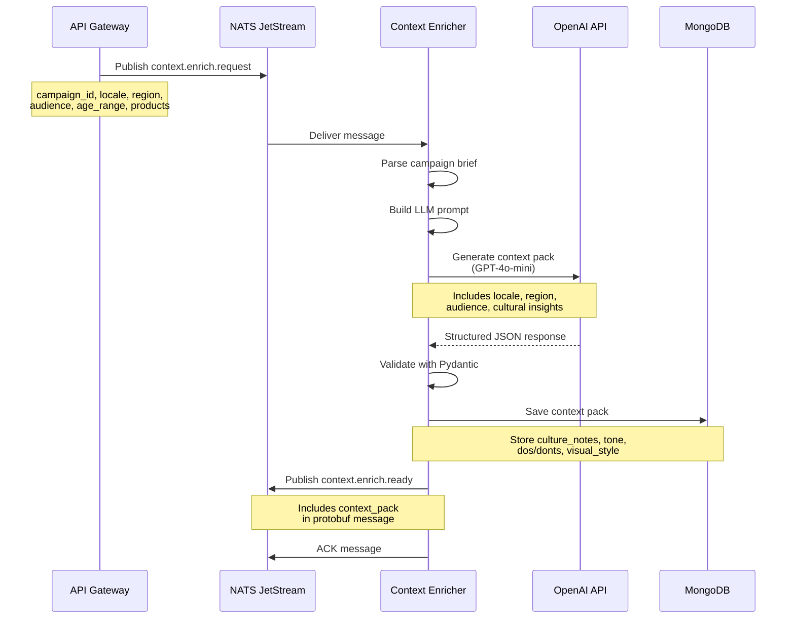

# Context Enricher Service

## Purpose

The **Context Enricher** generates locale-specific context for campaigns using GPT-4o-mini. It analyzes the target audience, region, and locale to create culturally-relevant guidance that informs the creative generation process.

## What It Does

1. **Receives** campaign briefs with audience and locale information
2. **Generates** locale-specific context including:
   - Cultural notes and sensitivities
   - Appropriate messaging tone
   - Visual style preferences
   - Do's and don'ts for the target market
   - Legal/compliance guidelines
3. **Saves** context pack to MongoDB
4. **Publishes** event to trigger creative generation

## Technology

- **AI Model:** GPT-4o-mini (text generation)
- **Input:** Campaign brief, audience data, locale
- **Output:** Structured context pack with cultural insights

---

## LLM Prompt

The service uses GPT-4o-mini with structured JSON output to generate context packs:

```
You are a cultural marketing consultant specializing in localized campaigns.

Generate a context pack for:
- Locale: {locale}
- Region: {region}
- Audience: {audience}
- Age Range: {age_min} - {age_max}
- Products: {product_names}

Provide cultural context, tone guidance, and best practices for this market.
Focus on what makes this audience unique and how to communicate effectively.

Respond with a JSON object in this EXACT format:
{
  "culture_notes": "detailed cultural insights and sensitivities for this locale/region",
  "tone": "recommended tone (e.g., professional, casual, warm, aspirational)",
  "dos": ["do 1", "do 2", "do 3"],
  "donts": ["dont 1", "dont 2", "dont 3"],
  "visual_style": "recommended visual aesthetic and style preferences",
  "legal_guidelines": "any legal or compliance considerations for this market"
}
```

### Information Passed to LLM

**Input Data:**
- `locale` - Target locale code (en, de, fr, it)
- `region` - Geographic region (e.g., "DACH", "UK", "France")
- `audience` - Target audience description (e.g., "Young professionals")
- `age_min` / `age_max` - Age range
- `product_names` - List of products in campaign
- `interests_text` - Optional interests/hobbies

**Pydantic Model (Structured Output):**
```python
class ContextPackResponse(BaseModel):
    culture_notes: str
    tone: str
    dos: List[str]
    donts: List[str]
    visual_style: str
    legal_guidelines: str
```

---

## Sequence Diagram



---

## Data Flow

### Input (from API)
```json
{
  "campaign_id": "summer-2025-skincare",
  "locale": "de",
  "region": "DACH",
  "audience": "Young professionals",
  "age_min": 25,
  "age_max": 45,
  "product_names": ["Vitamin C Serum", "Hydration Cream"]
}
```

### Output (to MongoDB + NATS)
```json
{
  "campaign_id": "summer-2025-skincare",
  "locale": "de",
  "culture_notes": "DACH region values precision, quality, and scientific backing...",
  "tone": "professional yet approachable",
  "dos": [
    "Emphasize product quality and efficacy",
    "Use formal 'Sie' initially",
    "Highlight natural ingredients"
  ],
  "donts": [
    "Avoid overly casual language",
    "Don't make unsubstantiated health claims",
    "Avoid aggressive sales tactics"
  ],
  "visual_style": "Clean, minimalist aesthetic with natural lighting...",
  "legal_guidelines": "Must comply with EU cosmetics regulations..."
}
```

---

## Service Configuration

**Environment Variables:**
- `OPENAI_API_KEY` - OpenAI API key
- `OPENAI_TEXT_MODEL` - Model name (default: `gpt-4o-mini`)
- `MONGODB_URL` - MongoDB connection string
- `NATS_URL` - NATS server URL

**NATS Subjects:**
- **Subscribes to:** `context.enrich.request`
- **Publishes to:** `context.enrich.ready`

**Retry Policy:**
- ACK wait: 60 seconds
- Max retries: 3
- Automatic retry on failure via NATS JetStream

---

## Key Features

✅ **Culturally-Aware:** Generates locale-specific insights  
✅ **Structured Output:** Uses Pydantic validation for consistent data  
✅ **Reliable:** Automatic retries via NATS  
✅ **Observable:** Emoji logs for easy monitoring  
✅ **Stateless:** Can scale horizontally
