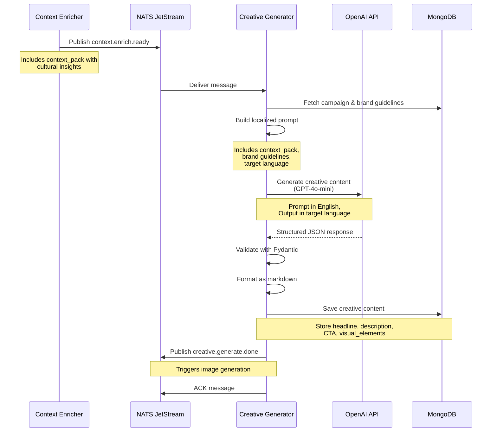

# Creative Generator Service

## Purpose

The **Creative Generator** creates campaign content (headlines, descriptions, CTAs) in the target language using GPT-4o-mini. It uses the enriched context pack to ensure culturally-appropriate, engaging copy that resonates with the local audience.

## What It Does

1. **Receives** context packs from Context Enricher
2. **Generates** creative content in the target language:
   - Catchy headline (5-15 words)
   - Campaign description (50-100 words)
   - Call-to-action (3-8 words)
   - Suggested visual elements
3. **Validates** content against brand guidelines and banned words
4. **Saves** creative content to MongoDB
5. **Publishes** event to trigger image generation

## Technology

- **AI Model:** GPT-4o-mini (multilingual text generation)
- **Languages:** English (en), German (de), French (fr), Italian (it)
- **Input:** Context pack + campaign brief
- **Output:** Structured creative content in target language

---

## LLM Prompt

The service uses GPT-4o-mini with structured JSON output to generate localized creative content:

```
Based on the following context, generate creative content IN {target_language.upper()}:

Campaign ID: {campaign_id}
Target Locale: {locale}
Target Language: {target_language}

Cultural Notes: {context_pack.culture_notes}
Tone: {context_pack.tone}
Do's: {', '.join(context_pack.dos)}
Don'ts: {', '.join(context_pack.donts)}
Banned Words: {', '.join(context_pack.banned_words)}
Legal Guidelines: {context_pack.legal_guidelines}
Brand Guidelines: {brand_guidelines}

CRITICAL: Generate ALL content (headline, description, call_to_action) in {target_language.upper()}.
The JSON keys should remain in English, but ALL VALUES must be in {target_language}.

Respond with a JSON object in this EXACT format:
{
  "headline": "catchy headline in {target_language} (5-15 words)",
  "description": "compelling description in {target_language} (50-100 words)",
  "call_to_action": "clear CTA in {target_language} (3-8 words)",
  "visual_elements": ["element 1 in {target_language}", "element 2", "element 3"]
}

Ensure ALL content:
1. Is written ENTIRELY in {target_language}
2. Respects the cultural notes and local customs
3. Follows the specified tone and guidelines
4. Avoids banned words and respects legal guidelines

Return ONLY the JSON object with all values in {target_language}.
```

### Information Passed to LLM

**Input Data:**
- `campaign_id` - Unique campaign identifier
- `locale` - Target locale (en, de, fr, it)
- `target_language` - Language name (English, German, French, Italian)
- `context_pack` - Full context from Context Enricher:
  - `culture_notes` - Cultural insights
  - `tone` - Recommended tone
  - `dos` - Best practices
  - `donts` - Things to avoid
  - `banned_words` - Prohibited words
  - `legal_guidelines` - Compliance requirements
- `brand_guidelines` - Optional brand-specific guidelines

**Pydantic Model (Structured Output):**
```python
class CampaignContentResponse(BaseModel):
    headline: str = Field(..., description="Catchy campaign headline (5-15 words)")
    description: str = Field(..., description="Short campaign description (50-100 words)")
    call_to_action: str = Field(..., description="Call-to-action text (3-8 words)")
    visual_elements: List[str] = Field(..., description="List of 3-5 suggested visual elements")
```

---

## Sequence Diagram



---

## Data Flow

### Input (from Context Enricher)
```json
{
  "campaign_id": "summer-2025-skincare",
  "locale": "de",
  "context_pack": {
    "culture_notes": "DACH region values precision and quality...",
    "tone": "professional yet approachable",
    "dos": ["Emphasize product quality", "Highlight natural ingredients"],
    "donts": ["Avoid overly casual language", "No unsubstantiated claims"],
    "banned_words": ["kostenlos", "Wunder", "garantiert"],
    "legal_guidelines": "Must comply with EU cosmetics regulations"
  }
}
```

### Output (to MongoDB)
```json
{
  "campaign_id": "summer-2025-skincare",
  "locale": "de",
  "headline": "Natürliche Schönheit jeden Tag",
  "description": "Entdecken Sie unsere premium Hautpflege-Kollektion mit natürlichen Inhaltsstoffen. Vitamin C Serum und Hydration Cream für strahlende, gesunde Haut. Wissenschaftlich getestet, dermatologisch bestätigt.",
  "call_to_action": "Jetzt entdecken",
  "visual_elements": [
    "Natürliche Inhaltsstoffe",
    "Elegante Produktverpackung",
    "Frische, saubere Ästhetik",
    "Hautpflege-Routine",
    "Strahlende Haut"
  ],
  "status": "generated",
  "created_at": "2025-01-15T10:30:00Z"
}
```

---

## Language Support

### Supported Locales

| Locale | Language | Notes |
|--------|----------|-------|
| `en` | English | Default, widely used |
| `de` | German | Formal "Sie" preferred initially |
| `fr` | French | Elegant, refined tone |
| `fr` | Italian | Warm, expressive communication |

### Content Validation

**The service ensures:**
- ✅ All content is in the target language
- ✅ Headline is 5-15 words
- ✅ Description is 50-100 words
- ✅ CTA is 3-8 words
- ✅ 3-5 visual elements suggested
- ✅ Banned words are avoided
- ✅ Brand guidelines are respected

---

## Service Configuration

**Environment Variables:**
- `OPENAI_API_KEY` - OpenAI API key
- `OPENAI_TEXT_MODEL` - Model name (default: `gpt-4o-mini`)
- `MONGODB_URL` - MongoDB connection string
- `NATS_URL` - NATS server URL

**NATS Subjects:**
- **Subscribes to:** `context.enrich.ready`
- **Publishes to:** `creative.generate.done`

**Retry Policy:**
- ACK wait: 120 seconds (2 minutes)
- Max retries: 3
- Automatic retry on failure via NATS JetStream

---

## Example Output by Locale

### English (en)
```
Headline: Shine every day with natural radiance
Description: Discover our premium skincare collection with natural ingredients. Vitamin C Serum and Hydration Cream for radiant, healthy skin. Scientifically tested, dermatologically confirmed.
CTA: Discover now
```

### German (de)
```
Headline: Natürliche Schönheit jeden Tag
Description: Entdecken Sie unsere premium Hautpflege-Kollektion mit natürlichen Inhaltsstoffen. Vitamin C Serum und Hydration Cream für strahlende, gesunde Haut.
CTA: Jetzt entdecken
```

### French (fr)
```
Headline: Rayonnez chaque jour naturellement
Description: Découvrez notre collection premium de soins avec des ingrédients naturels. Sérum Vitamine C et Crème Hydratation pour une peau radieuse et saine.
CTA: Découvrir maintenant
```

### Italian (it)
```
Headline: Splendi ogni giorno naturalmente
Description: Scopri la nostra collezione premium di prodotti per la cura della pelle con ingredienti naturali. Siero Vitamina C e Crema Idratante per una pelle radiosa e sana.
CTA: Scopri ora
```

---

## Key Features

✅ **Multilingual:** Generates content in 4 languages  
✅ **Context-Aware:** Uses cultural insights from enricher  
✅ **Brand-Compliant:** Respects guidelines and banned words  
✅ **Structured Output:** Consistent format via Pydantic  
✅ **Reliable:** Automatic retries via NATS  
✅ **Observable:** Emoji logs show language and content
