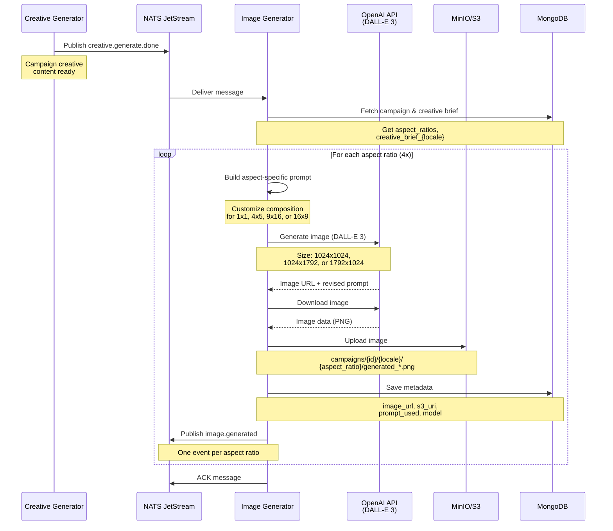

# Image Generator Service

## Purpose

The **Image Generator** creates product marketing images using OpenAI's DALL-E 3. It generates **4 different aspect ratios** per locale, each with composition optimized for its specific format (square, portrait, story, landscape).

## What It Does

1. **Receives** creative content from Creative Generator
2. **Fetches** campaign's creative brief and target aspect ratios
3. **Generates images** using DALL-E 3:
   - 1x1 (Square - Instagram feed)
   - 4x5 (Portrait - Instagram portrait)
   - 9x16 (Story - Instagram/TikTok stories)
   - 16x9 (Landscape - YouTube/banners)
4. **Downloads** each generated image
5. **Uploads** to S3/MinIO with organized structure
6. **Saves** metadata to MongoDB
7. **Publishes** event per aspect ratio for brand composition

## Technology

- **AI Model:** DALL-E 3 (OpenAI's latest image generation model)
- **Quality:** Standard (or HD if configured)
- **Sizes:** 1024x1024, 1024x1792, 1792x1024
- **Input:** Creative brief + locale-specific guidance
- **Output:** 4 optimized images per locale

---

## DALL-E 3 Prompt Strategy

The service generates **aspect-ratio-specific prompts** to optimize composition for each format:

### Base Prompt Template
```
Create a professional beauty/cosmetics product advertisement image WITHOUT any text, words, or typography.

Creative Brief (Style & Aesthetic):
{creative_brief}

Campaign Content (Message & Details):
{creative_content}

Composition for {aspect_ratio} format:
- {aspect_guidance}
- NO text, words, letters, or typography of any kind
- High-quality, professional product photography
- Soft, flattering lighting with clean aesthetics
- Minimalist and elegant style
- Clean background suitable for text overlay later
- Leave strategic space at BOTTOM for text overlay (campaign message will go there)
- Logo will be placed in UPPER HALF, so keep that area relatively clean
```

### Aspect Ratio Compositions

Each aspect ratio gets **customized composition guidance**:

| Aspect Ratio | DALL-E Size | Composition Guidance |
|--------------|-------------|----------------------|
| **1x1** (Square) | 1024x1024 | Centered composition with balanced symmetry, product prominently displayed in middle third, equal spacing on all sides |
| **4x5** (Portrait) | 1024x1792 | Vertical portrait composition with product in upper two-thirds, elegant vertical flow, space at bottom for text overlay |
| **9x16** (Story) | 1024x1792 | Tall vertical story format with product in center or upper portion, dramatic vertical composition, generous bottom space for text |
| **16x9** (Landscape) | 1792x1024 | Wide horizontal landscape composition with product positioned left or right of center, cinematic wide-angle view, space for text on opposite side |

### Information Passed to DALL-E 3

**Input Data:**
- `creative_brief` - Locale-specific style guidance (from campaign.localization)
- `creative_content` - Generated campaign content (headline + description)
- `aspect_ratio` - Target format (1x1, 4x5, 9x16, 16x9)
- `composition_guidance` - Format-specific composition instructions

**Example for German locale (de):**
```
Creative Brief: Create premium beauty product images featuring natural ingredients, 
soft lighting, and minimalist aesthetic

Campaign Content:
Headline: Natürliche Schönheit jeden Tag
Description: Entdecken Sie unsere premium Hautpflege-Kollektion...

Composition for 1x1 format:
- Centered composition with balanced symmetry...
```

---

## Sequence Diagram



---

## Data Flow

### Input (from Creative Generator)
```json
{
  "campaign_id": "summer-2025-skincare",
  "locale": "de",
  "correlation_id": "abc-123"
}
```

### Campaign Configuration (from MongoDB)
```json
{
  "campaign_id": "summer-2025-skincare",
  "output": {
    "aspect_ratios": ["1x1", "4x5", "9x16", "16x9"]
  },
  "localization": {
    "creative_brief_de": "Create premium beauty product images with natural ingredients..."
  }
}
```

### Output (per aspect ratio to MongoDB)
```json
{
  "campaign_id": "summer-2025-skincare",
  "locale": "de",
  "aspect_ratio": "1x1",
  "image_url": "https://oaidalleapiprodscus.blob.core.windows.net/...",
  "s3_uri": "s3://creative-assets/campaigns/summer-2025-skincare/de/1x1/generated_20250115_103045.png",
  "prompt_used": "Create a professional beauty/cosmetics product...",
  "model": "dall-e-3",
  "size": "1024x1024",
  "quality": "standard",
  "status": "generated",
  "generated_at": "2025-01-15T10:30:45Z"
}
```

---

## S3 Storage Structure

Images are organized by campaign, locale, and aspect ratio:

```
s3://creative-assets/
└── campaigns/
    └── summer-2025-skincare/
        ├── de/
        │   ├── 1x1/
        │   │   └── generated_20250115_103045.png
        │   ├── 4x5/
        │   │   └── generated_20250115_103112.png
        │   ├── 9x16/
        │   │   └── generated_20250115_103145.png
        │   └── 16x9/
        │       └── generated_20250115_103221.png
        └── en/
            ├── 1x1/
            ├── 4x5/
            ├── 9x16/
            └── 16x9/
```

---

## DALL-E 3 Configuration

### Size Mapping

DALL-E 3 only supports specific sizes, so we map aspect ratios:

| Aspect Ratio | Target Format | DALL-E 3 Size | Notes |
|--------------|---------------|---------------|-------|
| 1x1 | Square | 1024x1024 | Perfect match |
| 4x5 | Instagram Portrait | 1024x1792 | Uses 9:16 (closest match) |
| 9x16 | Story/Vertical | 1024x1792 | Perfect match |
| 16x9 | Landscape | 1792x1024 | Perfect match |

### Model Parameters

```python
response = await openai_client.images.generate(
    model="dall-e-3",
    prompt=prompt,
    size=image_size,  # "1024x1024", "1024x1792", or "1792x1024"
    quality="standard",  # or "hd" for higher quality
    n=1  # DALL-E 3 only supports n=1
)
```

---

## Service Configuration

**Environment Variables:**
- `OPENAI_API_KEY` - OpenAI API key
- `OPENAI_IMAGE_MODEL` - Model name (default: `dall-e-3`)
- `OPENAI_IMAGE_QUALITY` - Quality setting (`standard` or `hd`)
- `S3_ENDPOINT_URL` - MinIO/S3 endpoint
- `S3_BUCKET_NAME` - Bucket for image storage
- `MONGODB_URL` - MongoDB connection string
- `NATS_URL` - NATS server URL

**NATS Subjects:**
- **Subscribes to:** `creative.generate.done`
- **Publishes to:** `image.generated` (4 events per locale)

**Retry Policy:**
- ACK wait: 180 seconds (3 minutes - DALL-E can be slow)
- Max retries: 3
- Automatic retry on failure via NATS JetStream

---

## Key Features

✅ **Multi-Format:** Generates 4 aspect ratios automatically  
✅ **Optimized Composition:** Each format has tailored prompt  
✅ **No Text:** Images are clean for later text overlay  
✅ **Strategic Spacing:** Bottom space for text, top for logo  
✅ **High Quality:** DALL-E 3 with standard/HD quality  
✅ **Organized Storage:** S3 structure by campaign/locale/aspect  
✅ **Observable:** Logs show each generation step  
✅ **Reliable:** Retries on API failures

---

## Performance Considerations

**Generation Time:**
- ~10-30 seconds per image
- 4 images per locale = ~1-2 minutes total
- Varies based on DALL-E 3 API load

**Cost (approximate):**
- Standard quality: $0.040 per image
- HD quality: $0.080 per image
- 4 images/locale × 4 locales = 16 images = $0.64-$1.28 per campaign

**Optimization:**
- Images generated sequentially (not parallel) to avoid rate limits
- Can scale horizontally by adding more image-generator pods
- Each pod processes one locale at a time
