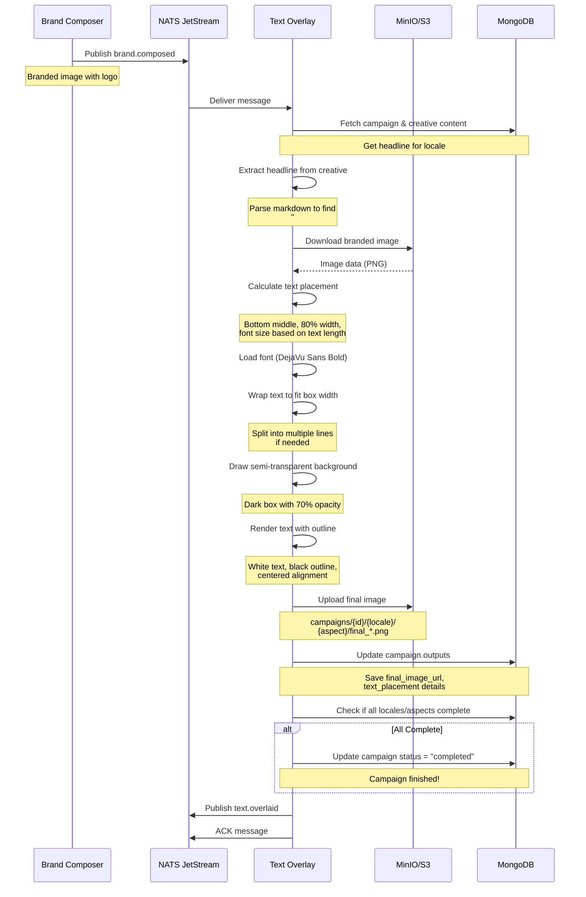

# Text Overlay Service

## Purpose

The **Text Overlay** service adds campaign message text to branded images using **code-based placement logic** (no LLM). It extracts the localized headline from the creative content and overlays it at the bottom of each image with a semi-transparent background for readability.

## What It Does

1. **Receives** branded images from Brand Composer
2. **Fetches** creative content to extract headline
3. **Downloads** branded image from S3
4. **Calculates** optimal text placement (bottom middle)
5. **Wraps text** to fit within image width
6. **Adds background box** with semi-transparency
7. **Renders text** with outline for readability
8. **Uploads** final image to S3
9. **Updates** campaign status (marks as completed when all locales/aspects done)
10. **Publishes** completion event

## Technology

- **Image Processing:** PIL (Pillow) for text rendering
- **Font:** DejaVu Sans Bold (system font)
- **Placement:** Code-based (bottom middle, no AI)
- **Input:** Branded image + localized headline
- **Output:** Final campaign asset ready for distribution

---

## Text Placement Logic

### Bottom Middle Strategy

Unlike logo placement (which uses AI), text overlay uses **deterministic code-based logic**:

**Why no AI?**
- ✅ Text always goes at bottom (predictable)
- ✅ Logo already placed in top half (AI ensured clean bottom space)
- ✅ Faster processing (no API call)
- ✅ Lower cost (no LLM usage)
- ✅ Consistent results

### Calculation Algorithm

```python
def calculate_bottom_middle_placement(width: int, height: int, text: str, brand_color: str) -> dict:
    # 1. Calculate font size based on image dimensions
    base_font_size = int(width * 0.05)  # 5% of image width
    
    # 2. Adjust for text length (longer text = smaller font)
    if len(text) > 60:
        font_size = int(base_font_size * 0.7)
    elif len(text) > 40:
        font_size = int(base_font_size * 0.85)
    else:
        font_size = base_font_size
    
    # 3. Ensure font size is within bounds
    font_size = max(25, min(80, font_size))
    
    # 4. Calculate box dimensions
    box_width = int(width * 0.8)  # 80% of image width
    
    # 5. Estimate required height for text
    chars_per_line = int(box_width / (font_size * 0.6))
    estimated_lines = max(1, (len(text) // chars_per_line) + 1)
    line_height = int(font_size * 1.4)
    box_height = (estimated_lines * line_height) + 40  # 40px padding
    
    # 6. Position in bottom middle
    margin_bottom = int(height * 0.05)  # 5% margin from bottom
    box_x = (width - box_width) // 2  # Center horizontally
    box_y = height - box_height - margin_bottom
    
    return {
        "box_x": box_x,
        "box_y": box_y,
        "box_width": box_width,
        "box_height": box_height,
        "font_size": font_size,
        "text_color": "#FFFFFF",  # White text
        "background_opacity": 0.7,  # 70% opaque dark background
        "alignment": "center"
    }
```

---

## Headline Extraction

The service extracts the headline from the creative content stored in MongoDB:

### Markdown Format (from Creative Generator)
```markdown
### 1. Catchy Headline
Natürliche Schönheit jeden Tag

### 2. Short Description
Entdecken Sie unsere premium Hautpflege-Kollektion...

### 3. Call-to-Action
Jetzt entdecken
```

### Extraction Logic

The service tries multiple patterns to find the headline:

```python
headline_patterns = [
    '### 1. Catchy Headline',  # Primary format
    '### 1. Catchy Headline:',
    '### Catchy Headline',
    '### Headline',
    '**Headline:**',
    # ... more fallback patterns
]

for pattern in headline_patterns:
    if pattern in content:
        # Extract text from same line or next line
        headline = extract_text_after_pattern(content, pattern)
        if headline and len(headline) > 5:
            campaign_message = headline
            break
```

**Extracted headline examples:**
- EN: "Shine every day with natural radiance"
- DE: "Natürliche Schönheit jeden Tag"
- FR: "Rayonnez chaque jour naturellement"
- IT: "Splendi ogni giorno naturalmente"

---

## Sequence Diagram



---

## Data Flow

### Input (from Brand Composer)
```json
{
  "campaign_id": "summer-2025-skincare",
  "locale": "de",
  "s3_uri_branded": "s3://creative-assets/campaigns/summer-2025-skincare/de/1x1/branded_20250115_103145.png"
}
```

### Creative Content (from MongoDB)
```json
{
  "campaign_id": "summer-2025-skincare",
  "locale": "de",
  "headline": "Natürliche Schönheit jeden Tag",
  "description": "Entdecken Sie unsere premium...",
  "call_to_action": "Jetzt entdecken"
}
```

### Text Placement Calculation
```json
{
  "box_x": 102,
  "box_y": 850,
  "box_width": 820,
  "box_height": 120,
  "font_size": 51,
  "text_color": "#FFFFFF",
  "use_brand_color": false,
  "background_opacity": 0.7,
  "alignment": "center",
  "reasoning": "Bottom middle placement: 820x120px box at (102,850), font size 51pt for 33 chars"
}
```

### Output (to MongoDB)
```json
{
  "campaign_id": "summer-2025-skincare",
  "outputs": {
    "de": {
      "1x1": {
        "final_image_s3_uri": "s3://creative-assets/.../final_20250115_103245.png",
        "final_image_url": "https://localhost:9000/...",
        "text_overlay_timestamp": "2025-01-15T10:32:45Z",
        "text_placement": { /* placement details */ }
      },
      "4x5": { /* ... */ },
      "9x16": { /* ... */ },
      "16x9": { /* ... */ }
    }
  },
  "status": "completed"
}
```

---

## Text Rendering Details

### Font Selection

The service tries multiple fonts in order:

1. **DejaVu Sans Bold** - `/usr/share/fonts/truetype/dejavu/DejaVuSans-Bold.ttf`
2. **Liberation Sans Bold** - `/usr/share/fonts/truetype/liberation/LiberationSans-Bold.ttf`
3. **Default PIL font** - Fallback if no fonts available

### Text Wrapping

```python
def wrap_text(text: str, font: ImageFont, max_width: int) -> list:
    """Wrap text to fit within max_width."""
    words = text.split()
    lines = []
    current_line = []
    
    for word in words:
        test_line = ' '.join(current_line + [word])
        bbox = font.getbbox(test_line)
        width = bbox[2] - bbox[0]
        
        if width <= max_width:
            current_line.append(word)
        else:
            if current_line:
                lines.append(' '.join(current_line))
            current_line = [word]
    
    if current_line:
        lines.append(' '.join(current_line))
    
    return lines
```

### Text Outline for Readability

The service draws a **black outline** around white text for maximum readability:

```python
# Draw outline (9 positions around the main text)
for adj_x in [-2, -1, 0, 1, 2]:
    for adj_y in [-2, -1, 0, 1, 2]:
        if adj_x != 0 or adj_y != 0:
            draw.text((text_x + adj_x, text_y + adj_y), line, font=font, fill=(0, 0, 0))

# Draw main text on top
draw.text((text_x, text_y), line, font=font, fill=(255, 255, 255))
```

---

## Campaign Completion Logic

The service checks if all locales and aspect ratios are complete:

```python
# Get target locales and aspect ratios
target_locales = campaign.get('target_locales', [])  # ['en', 'de', 'fr', 'it']
target_aspect_ratios = campaign.get('output', {}).get('aspect_ratios', [])  # ['1x1', '4x5', '9x16', '16x9']
outputs = campaign.get('outputs', {})

# Check if all combinations have final images
all_complete = all(
    outputs.get(loc, {}).get(ar, {}).get('final_image_url') is not None 
    for loc in target_locales
    for ar in target_aspect_ratios
)

if all_complete:
    # Mark campaign as completed
    await db.campaigns.update_one(
        {"_id": campaign_id},
        {"$set": {"status": "completed", "completed_at": datetime.utcnow()}}
    )
```

**Example:** Campaign with 2 locales (EN, DE) and 4 aspect ratios (1x1, 4x5, 9x16, 16x9) needs **8 final images** before marking completed.

---

## S3 Storage Structure

Final images are organized by campaign, locale, and aspect ratio:

```
s3://creative-assets/
└── campaigns/
    └── summer-2025-skincare/
        ├── de/
        │   ├── 1x1/
        │   │   ├── generated_*.png    ← Image Generator
        │   │   ├── branded_*.png      ← Brand Composer
        │   │   └── final_*.png        ← Text Overlay (THIS SERVICE)
        │   ├── 4x5/
        │   │   └── final_*.png
        │   ├── 9x16/
        │   │   └── final_*.png
        │   └── 16x9/
        │       └── final_*.png
        └── en/
            ├── 1x1/
            ├── 4x5/
            ├── 9x16/
            └── 16x9/
```

---

## Service Configuration

**Environment Variables:**
- `S3_ENDPOINT_URL` - MinIO/S3 endpoint (internal)
- `S3_EXTERNAL_ENDPOINT_URL` - MinIO/S3 endpoint (for presigned URLs)
- `S3_BUCKET_NAME` - Bucket for image storage
- `MONGODB_URL` - MongoDB connection string
- `NATS_URL` - NATS server URL

**NATS Subjects:**
- **Subscribes to:** `brand.composed`
- **Publishes to:** `text.overlaid`

**Retry Policy:**
- ACK wait: 180 seconds (3 minutes)
- Max retries: 3
- Automatic retry on failure via NATS JetStream

---

## Key Features

✅ **Deterministic:** Consistent placement via code (no AI randomness)  
✅ **Fast:** No LLM API calls, pure image processing  
✅ **Readable:** Semi-transparent background + text outline  
✅ **Responsive:** Font size adapts to text length and image size  
✅ **Multi-line:** Automatic text wrapping for long headlines  
✅ **Localized:** Uses language-specific headline from creative  
✅ **Completion Tracking:** Marks campaign as done when all assets ready  
✅ **Observable:** Logs show extracted text and placement details

---

## Performance Considerations

**Processing Time:**
- Headline extraction: <100ms
- Image download: ~1-2 seconds
- Text rendering: <500ms
- Upload: ~1-2 seconds
- **Total: ~3-5 seconds per image**

**Cost:**
- No LLM API calls = $0.00 per image
- Only S3 storage and data transfer costs

**Scalability:**
- Very lightweight, minimal CPU/memory
- Can scale to many pods easily
- Each pod processes one image at a time

---

## Comparison: AI vs Code-Based

### AI-Powered (Brand Composer - Logo)
- ✅ Intelligent analysis of image content
- ✅ Adapts to any composition
- ⚠️ Costs ~$0.001-0.002 per image
- ⚠️ Takes ~2-5 seconds per image

### Code-Based (Text Overlay - Text)
- ✅ Fast and deterministic
- ✅ Zero cost (no API calls)
- ✅ Predictable results
- ✅ Bottom placement always works (logo cleared top space)

**Verdict:** For text overlay, **code-based is optimal** because:
1. Logo already cleared bottom space
2. Text always goes at bottom (predictable)
3. Faster and cheaper than AI
4. Still looks professional with good typography
